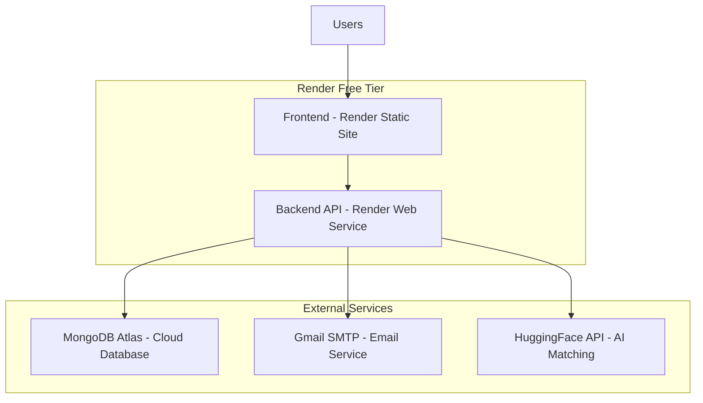
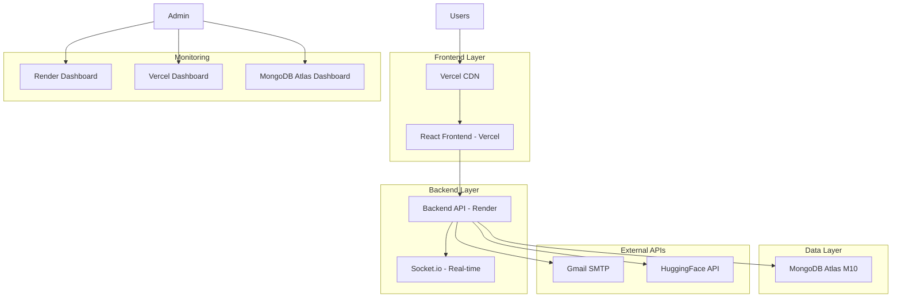
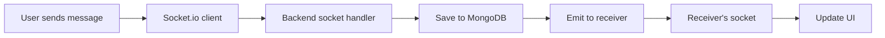
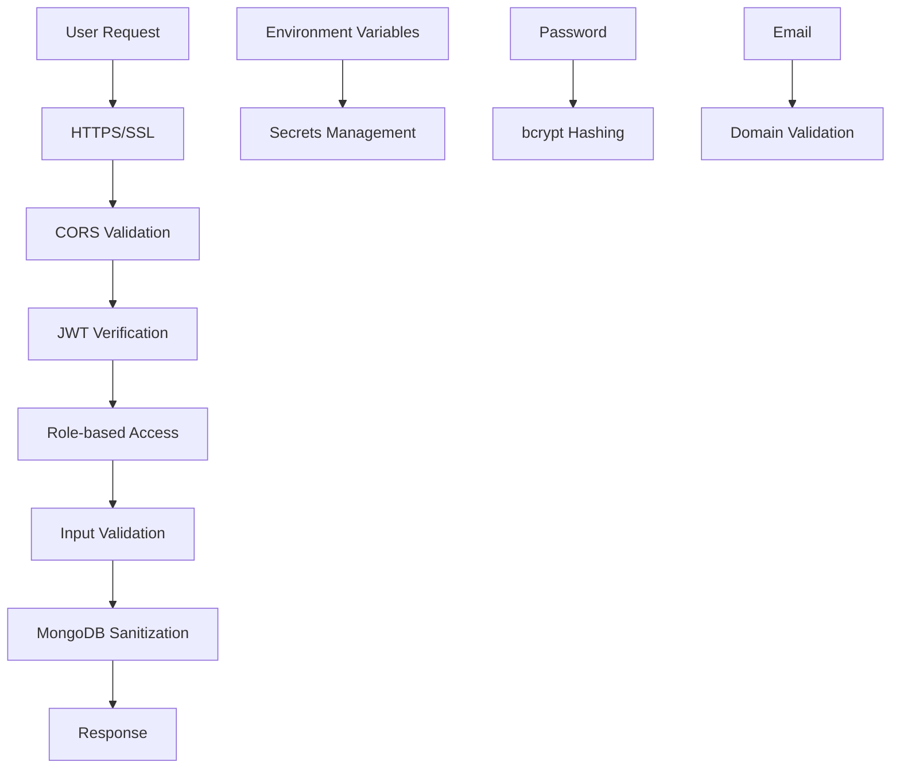

# 🎨 College Talent Hub - Deployment Architecture

## Recommended Deployment Architecture (Render - Free Tier)



## Production Deployment Architecture (Vercel + Render)



## Component Breakdown

### Frontend (React)
- **Hosting:** Render Static Site or Vercel
- **Build:** Create React App production build
- **CDN:** Automatic with Vercel
- **SSL:** Automatic HTTPS
- **Files Served:** Static HTML, CSS, JS

### Backend (Node.js/Express)
- **Hosting:** Render Web Service
- **Runtime:** Node.js 18+
- **Process Manager:** Render's built-in
- **SSL:** Automatic HTTPS
- **Features:** 
  - REST API
  - Socket.io for real-time chat
  - JWT authentication
  - File upload handling

### Database (MongoDB)
- **Hosting:** MongoDB Atlas
- **Tier:** M0 Free (512 MB) or M10 Production
- **Backup:** Automated with Atlas
- **Security:** IP whitelist, encrypted connections
- **Collections:**
  - users
  - posts
  - jobs
  - competitions
  - messages
  - notifications
  - recommendations

### Email Service (Gmail)
- **Service:** Gmail SMTP
- **Port:** 587 (TLS)
- **Authentication:** App Password
- **Usage:** Job match notifications, password reset

### AI Service (HuggingFace)
- **API:** HuggingFace Inference API
- **Usage:** Skill matching, job recommendations
- **Model:** Text embeddings for similarity

## Data Flow

### User Registration Flow

```mermaid
graph LR
    A[User enters details] --> B[Frontend validates]
    B --> C[POST /api/auth/register]
    C --> D[Backend validates email]
    D --> E[Hash password]
    E --> F[Save to MongoDB]
    F --> G[Generate JWT]
    G --> H[Return token]
    H --> I[Frontend stores token]
    I --> J[Redirect to dashboard]
```


### Job Matching Flow

```mermaid
graph LR
    A[Recruiter posts job] --> B[Backend receives job]
    B --> C[Extract required skills]
    C --> D[Query students with skills]
    D --> E[Calculate match percentage]
    E --> F[Filter 30%+ matches]
    F --> G[Send email notifications]
    G --> H[Save recommendations]
    H --> I[Return matched students]
```


### Real-time Chat Flow


## Deployment Environments

### Development
- **Frontend:** http://localhost:3000
- **Backend:** http://localhost:5000
- **Database:** Local MongoDB or Atlas
- **Hot Reload:** Enabled
- **Debug:** Full logs

### Production
- **Frontend:** https://your-app.vercel.app
- **Backend:** https://your-api.onrender.com
- **Database:** MongoDB Atlas (cloud)
- **Minified:** Yes
- **Logs:** Error level only

## Scaling Strategy

### Phase 1: MVP (Free Tier)
- **Users:** 0-100
- **Frontend:** Render Static
- **Backend:** Render Free (1 instance)
- **Database:** MongoDB M0 (512 MB)
- **Cost:** $0/month
- **Limitations:** 
  - Backend sleeps after 15 min
  - 512 MB database limit
  - Limited bandwidth

### Phase 2: Growing (Starter Tier)
- **Users:** 100-1,000
- **Frontend:** Vercel Hobby
- **Backend:** Render Starter (always on)
- **Database:** MongoDB M10 (10 GB)
- **Cost:** ~$70/month
- **Benefits:**
  - No sleep
  - Better performance
  - More storage
  - Custom domains

### Phase 3: Production (Professional)
- **Users:** 1,000-10,000
- **Frontend:** Vercel Pro + CDN
- **Backend:** Render Professional (multiple instances)
- **Database:** MongoDB M20 (20 GB)
- **Cost:** ~$200/month
- **Benefits:**
  - High availability
  - Load balancing
  - Auto-scaling
  - Priority support

### Phase 4: Enterprise (Custom)
- **Users:** 10,000+
- **Infrastructure:** AWS/Azure/GCP
- **Backend:** Kubernetes cluster
- **Database:** MongoDB Dedicated
- **CDN:** CloudFront/Cloudflare
- **Cost:** $500-2,000/month
- **Benefits:**
  - Full control
  - Maximum performance
  - Custom SLA
  - Dedicated support

## Security Layers



## Monitoring & Maintenance

### Health Checks
- **Endpoint:** `/api/health`
- **Frequency:** Every 5 minutes
- **Tool:** UptimeRobot (free)
- **Alerts:** Email on downtime

### Logs
- **Frontend:** Browser console (errors only)
- **Backend:** Render logs or CloudWatch
- **Database:** MongoDB Atlas monitoring
- **Retention:** 7-30 days

### Backups
- **Database:** Daily automated (Atlas)
- **Code:** Git repository
- **Environment:** Documented separately
- **Recovery:** Point-in-time restore

### Updates
- **Dependencies:** Monthly security updates
- **Node.js:** Update to LTS versions
- **Database:** Atlas auto-updates
- **SSL:** Auto-renewed certificates

## Cost Breakdown (Monthly)

### Free Tier Setup
```
MongoDB Atlas M0:        $0
Render Frontend:         $0
Render Backend:          $0
Domain (optional):       $0-12
Gmail SMTP:             $0
HuggingFace API:        $0 (free tier)
------------------------
Total:                   $0-12/month
```

### Production Setup
```
MongoDB Atlas M10:       $57
Vercel Pro:             $20
Render Starter (x2):    $14
Domain:                 $12
Email Service:          $0
Monitoring:             $0
------------------------
Total:                   $103/month
```

### Enterprise Setup
```
MongoDB Atlas M30:       $200
AWS EC2 (x3):           $150
Load Balancer:          $30
CloudFront CDN:         $50
Domain + SSL:           $20
Monitoring (DataDog):   $50
------------------------
Total:                   $500/month
```

## Performance Targets

### Free Tier
- **Page Load:** < 3 seconds
- **API Response:** < 500ms (when awake)
- **Uptime:** 99% (excluding sleep)
- **Concurrent Users:** 10-20

### Production Tier
- **Page Load:** < 1 second
- **API Response:** < 200ms
- **Uptime:** 99.9%
- **Concurrent Users:** 100-500

### Enterprise Tier
- **Page Load:** < 500ms
- **API Response:** < 100ms
- **Uptime:** 99.99%
- **Concurrent Users:** 1,000+

## Quick Reference

| Service | Purpose | Free Tier | Paid Tier |
|---------|---------|-----------|-----------|
| Render | Backend hosting | ✅ Yes | $7/mo |
| Vercel | Frontend hosting | ✅ Yes | $20/mo |
| MongoDB Atlas | Database | ✅ 512MB | $57/mo (10GB) |
| Gmail SMTP | Email | ✅ Yes | Included |
| HuggingFace | AI API | ✅ Limited | Pay per use |
| Domain | Custom URL | ❌ No | $12/year |

---

**This architecture supports:**
- ✅ Thousands of users
- ✅ Real-time features
- ✅ File uploads
- ✅ AI-powered matching
- ✅ Email notifications
- ✅ Admin dashboard
- ✅ Analytics and reporting

**Choose your deployment path based on:**
- Budget available
- Expected user count
- Performance requirements
- Technical expertise
- Scalability needs
